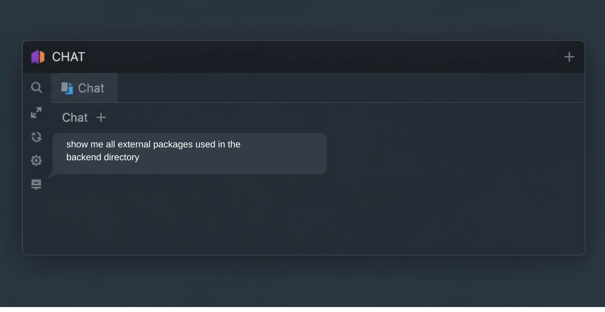

# Tools

The `tools` directory contains the logic for code analysis, including building the graph, finding code, and extracting imports.

## `GraphBuilder`

The `GraphBuilder` class in `graph_builder.py` is responsible for parsing the source code and building the graph representation that is stored in the Neo4j database.

### `TreeSitterParser`

`GraphBuilder` uses the `TreeSitterParser` class, which is a generic parser wrapper for a specific language using the tree-sitter library. This allows CodeGraphContext to support multiple programming languages in a modular way.

### Graph Building Process

The graph building process consists of several steps:

1.  **Pre-scan for Imports:** A quick scan of all files to build a global map of where every symbol is defined.
2.  **Parse Files:** Each file is parsed in detail to extract its structure, including functions, classes, variables, and imports.
3.  **Add Nodes to Graph:** The extracted code elements are added to the graph as nodes.
4.  **Create Relationships:** Relationships between the nodes are created, such as `CALLS` for function calls and `INHERITS` for class inheritance.

## `CodeFinder`

The `CodeFinder` class in `code_finder.py` provides functionality to search for specific code elements and analyze their relationships within the indexed codebase.

### Key Methods

-   `find_by_function_name()`: Finds functions by name.
-   `find_by_class_name()`: Finds classes by name.
-   `find_by_variable_name()`: Finds variables by name.
-   `find_by_content()`: Finds code by content matching in source or docstrings.
-   `find_related_code()`: Finds code related to a query using multiple search strategies.
-   `analyze_code_relationships()`: Analyzes different types of code relationships, such as callers, callees, importers, and class hierarchies.

## `ImportExtractor`

The `ImportExtractor` class in `import_extractor.py` is a utility for extracting package and module imports from source code files of various programming languages. It uses the most appropriate parsing technique for each language, such as AST for Python and regular expressions for JavaScript.

# Tools Exploration
There are a total of 14 tools available to the users, and here we have attached illustrative demos for each one of them.

## find_code Tool

The `find_code` tool allows users to search for code snippets, functions, classes, and variables within the codebase using natural language queries. This tool helps developers understand and navigate large codebases efficiently.

Below is an embedded link to a demo video showcasing the usage of the `find_code` tool in action.

---

## watch_directory Tool

The `watch_directory` tool allows users to monitor a specified directory for file changes, additions, or deletions in real-time. It helps developers automate workflows such as triggering scripts, updating indexes, or syncing files whenever changes occur in the directory.

Below is an embedded link to a demo video showcasing the usage of the `watch_directory` tool in a development environment.
 

---

## analyze_code_relationships Tool

The `analyze_code_relationships` tool in CodeGraphContext is designed to let users query and explore the various relationships between code elements in a codebase, represented as a graph in Neo4j. 

### Relationship Types That Can Be Analyzed

- **CALLS:** Finds which functions call or are called by a function.
- **CALLED_BY:** Finds all functions that directly or indirectly call a target function (inverse of CALLS).
- **INHERITS_FROM:** Finds class inheritance relationships; which classes inherit from which.
- **CONTAINS:** Shows containment (which classes/functions are inside which modules or files).
- **IMPLEMENTS:** Shows which classes implement an interface.
- **IMPORTS:** Identifies which files or modules import a specific module.
- **DEFINED_IN:** Locates where an entity (function/class) is defined.
- **HAS_ARGUMENT:** Shows relationships from functions to their arguments.
- **DECLARES:** Finds variables declared in functions or classes.

Below is an embedded link to a demo video showcasing the usage of the `analyse_code_relationships` tool.
 

---

## list_imports tool

The `list_imports` tool allows users to retrieve and inspect all the import statements across a given codebase or within a specific file. 
It helps developers (and AI assistants) understand external dependencies, module usage, and overall package structure within a project.

### Typical Scenarios

- View All Imports in a Project

- Inspect Imports in a Single File

- Dependency Auditing

Below is an embedded link to a demo video showcasing the usage of the `list_imports` tool. 

